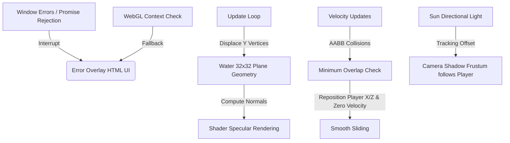

# Technical Design: Gameplay and Graphics Improvements for Mondo

## 1. Technical Approach & Architecture Decisions

This design outlines the technical updates required to resolve collision teleportation issues, enhance lighting and rendering quality, add dynamic water animations, and integrate crash fallback overlays.

### Key Architectural Choices:
* **First-Person Shadow Layer Isolation**: The player model must cast shadows but remain invisible to the first-person camera view. We assign the player mesh (and child meshes) to **Layer 1** and make it visible. The main camera stays on **Layer 0** (standard rendering), while the sun directional light shadow camera renders **Layers 0 and 1**.
* **Sliding Collision Physics**: Instead of radial push-outs from structure centers, the player's bounding box will use an **AABB minimum penetration** depth resolution. The player is pushed out along the axis of minimum overlap (X or Z) by the overlap distance, and the corresponding velocity is set to 0. Iterative bounds updates allow smooth sliding along structures.
* **Dynamic Water Waves**: We subdivide the water plane (32x32 segments) and dynamically offset its vertices on the CPU using a trigonometric wave formula in the render loop. Recomputing vertex normals preserves specular reflection.
* **Enhanced Tone Mapping**: ACES Filmic Tone Mapping will be applied to the WebGL renderer to produce realistic lighting contrast.
* **Error Boundaries**: WebGL presence is verified on launch. Unhandled exceptions are caught globally to stop the simulation, release pointer lock, and display a graphical crash container UI.

---

## 2. Data Flow



---

## 3. File Changes

| File Pathway | Changes Description |
| :--- | :--- |
| [src/render/scene.ts](file:///C:/Users/pietr/progetti/mondo/src/render/scene.ts) | 1. Enable directional light (sun) to cast shadows.<br>2. Set shadow map resolution to 2048x2048.<br>3. Set narrow frustum bounds (left/right/top/bottom: 60, far: 500) and shadow bias (-0.0005) to eliminate shadow acne. |
| [src/main.ts](file:///C:/Users/pietr/progetti/mondo/src/main.ts) | 1. Check `WebGLRenderingContext` on startup. Display blocking `#error-overlay` if missing.<br>2. Setup global `window.onerror` and `window.onunhandledrejection` boundaries.<br>3. Set `renderer.toneMapping = THREE.ACESFilmicToneMapping`. <br>4. Configure shadow camera layers to enable Layer 1: `sun.shadow.camera.layers.enable(1)`.<br>5. Position sun directional light and target following player X/Z coordinates.<br>6. Map water geometry position attribute vertices with sine/cosine wave based on `gameTime` and call `geometry.computeVertexNormals()`. |
| [src/world/terrain.ts](file:///C:/Users/pietr/progetti/mondo/src/world/terrain.ts) | Set `terrain.receiveShadow = true`. |
| [src/world/water.ts](file:///C:/Users/pietr/progetti/mondo/src/world/water.ts) | Initialize `THREE.PlaneGeometry` with 32 width and 32 height segments. |
| [src/world/decorations.ts](file:///C:/Users/pietr/progetti/mondo/src/world/decorations.ts) | Set `castShadow = true` and `receiveShadow = true` on the instanced meshes (trees, rocks, cacti). |
| [src/world/features.ts](file:///C:/Users/pietr/progetti/mondo/src/world/features.ts) | Traverse the `structures` Group and set `castShadow = true` and `receiveShadow = true` on all nested child meshes. |
| [src/entities/Player.ts](file:///C:/Users/pietr/progetti/mondo/src/entities/Player.ts) | 1. Keep mesh visible: `this.mesh.visible = true`. Traverse child meshes and assign them to Layer 1 (`child.layers.set(1)`), setting casting and receiving shadow attributes.<br>2. Replace structure collision resolution: Calculate overlap distance on X and Z axis for each intersecting AABB. Reposition player along the axis of minimum overlap, set corresponding velocity component to 0, and update bounding box dimensions iteratively inside the loop. |
| [src/entities/Monster.ts](file:///C:/Users/pietr/progetti/mondo/src/entities/Monster.ts) | Traverse the monster mesh group and set `castShadow = true` and `receiveShadow = true` on all meshes. |
| [src/entities/NPC.ts](file:///C:/Users/pietr/progetti/mondo/src/entities/NPC.ts) | Traverse the NPC mesh group and set `castShadow = true` and `receiveShadow = true` on all meshes. |

---

## 4. Interfaces / Contracts

```typescript
// Error Fallback Interface
interface ErrorOverlay {
  id: "error-overlay";
  reloadButtonId: "error-reload-btn";
}

// Player Box Physics Collision Contract
interface StructureCollider {
  box: THREE.Box3;
  type: 'solid' | 'trigger';
}
```

---

## 5. Testing Strategy

* **Unit Testing** (`tests/unit/player.test.ts`):
  * Test collision sliding math: Verify a player colliding at (5.2, 0, 0) with a structure box centered at (0, 0, 0) and spanning [-5, 5] is resolved exactly to X = 5.5 and Z movement is unimpeded.
  * Ensure sequential, multi-collider resolution updates player positions iteratively rather than resolving only the first intersection.
* **E2E Testing** (`tests/e2e/smoke.spec.ts`):
  * Verify presence of WebGL error fallback overlay when mock WebGL context returns null.
  * Emulate unhandled runtime exception and check that global handler launches `#error-overlay` and locks rendering loops.

---

## 6. Open Questions

* **Performance Limits**: Will CPU-bound vertex animation for water with `computeVertexNormals()` cause stuttering on mobile? *Mitigation: Segment size of 32x32 yields 1089 vertices, which is extremely lightweight for modern JS engines.*
