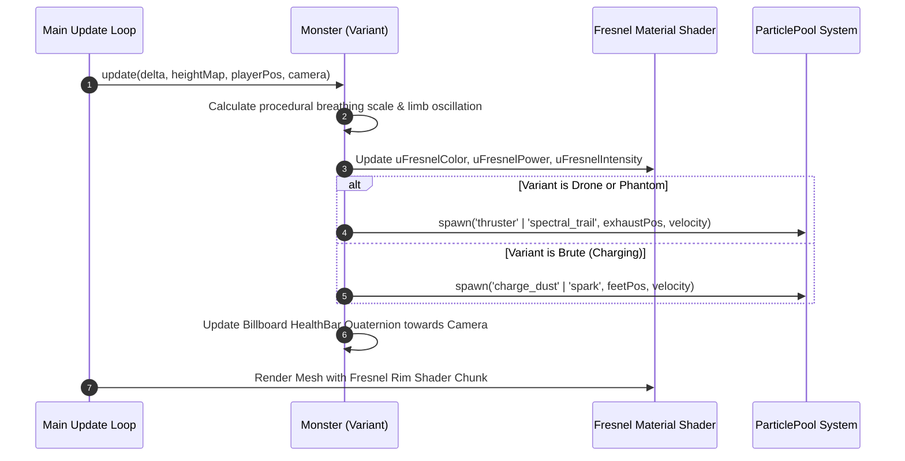
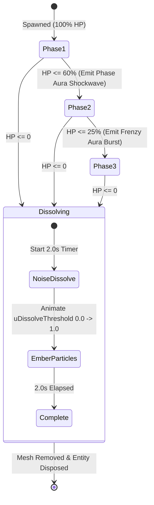
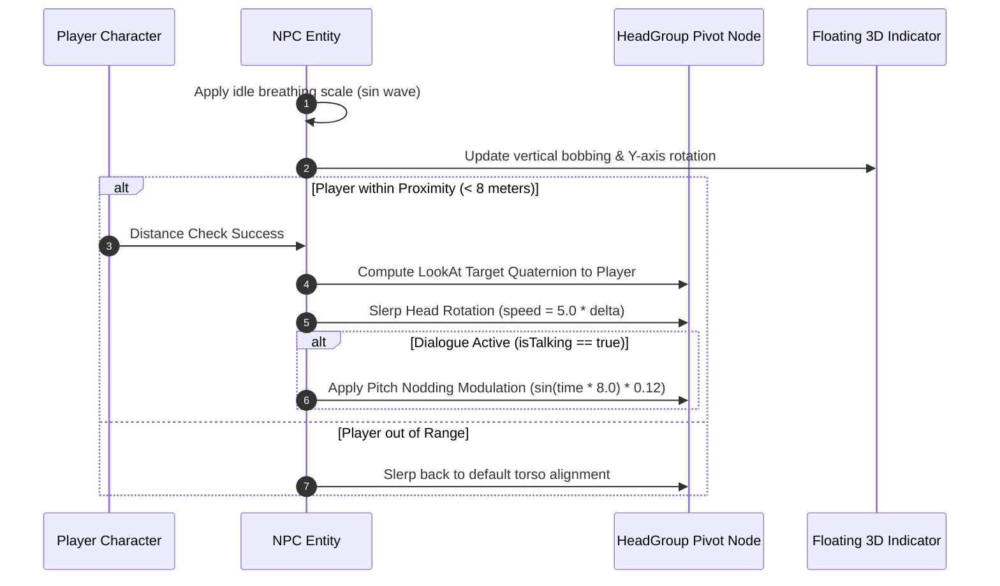

# Architecture Design: Enemy and NPC Visual Enhancements

This document outlines the detailed architecture, shader specifications, particle system extensions, composite geometry breakdown, and animation logic for the `enemy-and-npc-visual-enhancements` change.

---

## 1. Executive Summary & Architecture Overview

The purpose of this change is to elevate the visual fidelity and readability of enemies, bosses, and non-player characters (NPCs) across all biomes. The baseline implementation relies on monolithic box meshes, static NPC models, basic particle types, and abrupt boss despawns.

This architecture introduces five key pillars:
1. **Multi-primitive Composite Monster Geometries**: Modular multi-primitive mesh assemblies using `CapsuleGeometry`, `DodecahedronGeometry`, `IcosahedronGeometry`, `CylinderGeometry`, `TorusGeometry`, and `ConeGeometry` for all 12 monster variants.
2. **Fresnel Rim Shader Lighting**: Custom fragment shader chunk injection in `materials.ts` via `onBeforeCompile` to render dynamic silhouette rim highlights in dark and low-contrast biomes.
3. **Particle System Extensions & Throttling**: Support for thruster exhausts, spectral trails, charge dust, and boss dissolve embers in `particles.ts`, governed by delta-time emission throttles in `Monster.ts`.
4. **Boss Phase Aura & Procedural Dissolve Shader**: Radial shockwave particle emission on phase shifts, and a 2.0-second noise-threshold dissolve disintegration shader upon boss defeat in `BossMonster.ts`.
5. **NPC Animation & Floating 3D Status Indicators**: Procedural sine-wave breathing scale, smooth neck/head node slerp tracking towards the player with active dialogue nodding, and assembled 3D primitive `!` and `?` status markers in `NPC.ts`.

---

## 2. Architecture Sequence & State Flow Diagrams

### 2.1 Enemy Rendering & Particle Trail Cycle


### 2.2 Boss Lifecycle & Dissolve State Machine


### 2.3 NPC Proximity & Head Tracking Cycle


---

## 3. Multi-Primitive Monster Geometry Architecture

Monsters in `Monster.ts` are restructured from single rigid boxes into hierarchical assemblies consisting of a base root `Group`, torso primitive, head/core primitive, articulated limb pivot groups, and decorative armor or accent primitives.

```
Monster (Group)
 ├── Torso (Mesh: Capsule/Dodecahedron/Box)
 ├── Head/Core Group (Mesh: Icosahedron/Sphere)
 ├── Arm/Limb Groups [Left, Right] (Pivots + Cylinder/Capsule Meshes)
 ├── Armor Plates / Spikes / Wings (Meshes)
 └── HealthBarGroup (Group -> Billboarded)
```

### 3.1 Detailed Variant Geometry Compositions

| Variant | Scale | Primary Torso | Head / Core | Limbs & Appendages | Accents & Armor | Signature Colors |
| :--- | :--- | :--- | :--- | :--- | :--- | :--- |
| **`scout`** | 0.86 | `CapsuleGeometry(0.3, 0.6, 8, 12)` | `IcosahedronGeometry(0.25, 1)` | 4 x `CylinderGeometry(0.04, 0.04, 0.5)` legs | Aerodynamic back fins (`ConeGeometry`) | Body: `0x4caf50`, Rim/Eye: `0xb2ff59` |
| **`brute`** | 1.18 | `DodecahedronGeometry(0.7, 1)` | `CapsuleGeometry(0.35, 0.4, 6, 8)` | 2 x Heavy arm `CapsuleGeometry(0.2, 0.6)` | Dual shoulder armor boxes, 4 back spikes (`ConeGeometry`) | Body: `0xd32f2f`, Rim/Eye: `0xffd54f` |
| **`stalker`** | 1.00 | Tapered `CapsuleGeometry(0.25, 0.9, 8, 12)` | Sleek `ConeGeometry(0.2, 0.5, 6)` | 4 x Articulated leg `CylinderGeometry(0.05, 0.03, 0.7)` | Triple head crest cones (`ConeGeometry`) | Body: `0x7b1fa2`, Rim/Eye: `0x80deea` |
| **`golem`** | 1.60 | Heavy `DodecahedronGeometry(1.0, 0)` | Inset `BoxGeometry(0.5, 0.4, 0.5)` | 2 x Pillar leg `CylinderGeometry(0.25, 0.3, 0.9)`, 2 x Blocky fists | Glowing chest rune cross (`BoxGeometry`) | Body: `0x607D8B`, Rim/Eye: `0x00E5FF` |
| **`crawler`** | 0.80 | Flattened `CapsuleGeometry(0.4, 0.5, 6, 8)` | Frontal `IcosahedronGeometry(0.2, 0)` | 6 x Articulated jointed leg `CylinderGeometry(0.04, 0.03, 0.6)` | Cluster of 6 red eye spheres (`SphereGeometry`) | Body: `0xd32f2f`, Rim/Eye: `0xffeb3b` |
| **`drone`** | 0.60 | Central `IcosahedronGeometry(0.35, 1)` | Inset camera sphere (`SphereGeometry(0.12)`) | Spinning propeller shaft & blades (`Cylinder` + `Box`) | Dual outer stabilizer rings (`TorusGeometry(0.5, 0.05, 8, 24)`), Thruster nozzle | Body: `0x00bcd4`, Rim/Eye: `0xffffff` |
| **`sentinel`** | 1.10 | Cylindrical mech body `CylinderGeometry(0.35, 0.45, 1.0, 10)` | Swiveling dome head `SphereGeometry(0.3, 10, 8)` | 2 x Articulated leg cylinders | Dual shoulder-mounted cannon barrels (`CylinderGeometry`), glowing core sphere | Body: `0x00ACC1`, Rim/Eye: `0x84FFFF` |
| **`annihilator`** | 1.40 | Heavy `DodecahedronGeometry(0.9, 1)` | Armored visor box (`BoxGeometry(0.6, 0.2, 0.3)`) | 2 x Reinforced leg pillars | Triple-barrel gun turret (`CylinderGeometry`), dual angled shoulder plates | Body: `0x37474F`, Rim/Eye: `0xFF6D00` |
| **`phantom`** | 0.90 | Tapering ethereal `CapsuleGeometry(0.3, 0.9, 8, 12)` | Floating `IcosahedronGeometry(0.3, 1)` | 2 x Floating aura wing blades (`ConeGeometry(0.08, 0.7, 4)`) | Lower spectral wisps, translucent material | Body: `0x4A148C`, Rim/Eye: `0xEA80FC` |
| **`titan`** | 2.20 | Massive composite `DodecahedronGeometry(1.4, 1)` | Reinforced head enclosure box | 2 x Heavy pillar leg cylinders | Dual titan cannon barrels (`CylinderGeometry`), glowing chest reactor core sphere | Body: `0x212121`, Rim/Eye: `0xFF1744` |
| **`barbone`** | 1.25 | Rugged `CapsuleGeometry(0.4, 0.8, 8, 12)` | Rugged head sphere | 2 x Arm boxes, 2 x Leg cylinders | Handlebar mustache boxes, long inverted beard cone (`ConeGeometry`), hair top | Body: `0x4E342E`, Rim/Eye: `0xFFAB00` |
| **`punk`** | 0.95 | Agile `CapsuleGeometry(0.3, 0.7, 8, 12)` | Cyber head sphere | 2 x Arm boxes, 2 x Leg cylinders | 5 x Spiky neon mohawk cones (`ConeGeometry`) along skull ridge | Body: `0x880E4F`, Rim/Eye: `0x00E5FF` |

---

## 4. Fresnel Rim Shader Architecture

To solve poor enemy visibility in dark biomes and night cycles, materials created in `src/render/materials.ts` are injected with custom GLSL shader code using `MeshStandardMaterial.onBeforeCompile`.

### 4.1 Shader Modification & Uniform Definitions

Factory function `createFresnelMaterial(options)` creates or modifies a `MeshStandardMaterial`:

```typescript
export interface FresnelMaterialOptions {
  color: number;
  fresnelColor: THREE.Color;
  fresnelPower?: number;
  fresnelIntensity?: number;
  roughness?: number;
  metalness?: number;
}

export function createFresnelMaterial(options: FresnelMaterialOptions): THREE.MeshStandardMaterial {
  const material = new THREE.MeshStandardMaterial({
    color: options.color,
    roughness: options.roughness ?? 0.6,
    metalness: options.metalness ?? 0.2,
    flatShading: true,
  });

  const uniforms = {
    uFresnelColor: { value: options.fresnelColor },
    uFresnelPower: { value: options.fresnelPower ?? 3.0 },
    uFresnelIntensity: { value: options.fresnelIntensity ?? 1.2 },
  };

  material.onBeforeCompile = (shader) => {
    // 1. Attach uniforms
    Object.assign(shader.uniforms, uniforms);

    // 2. Inject vertex shader varyings for normal and view position
    shader.vertexShader = shader.vertexShader.replace(
      `#include <common>`,
      `
      #include <common>
      varying vec3 vFresnelNormal;
      varying vec3 vFresnelViewPosition;
      `
    );
    shader.vertexShader = shader.vertexShader.replace(
      `#include <worldpos_vertex>`,
      `
      #include <worldpos_vertex>
      vFresnelNormal = normalize(normalMatrix * normal);
      vFresnelViewPosition = -(modelViewMatrix * vec4(position, 1.0)).xyz;
      `
    );

    // 3. Inject fragment shader uniform declarations and rim glow calculation
    shader.fragmentShader = shader.fragmentShader.replace(
      `#include <common>`,
      `
      #include <common>
      uniform vec3 uFresnelColor;
      uniform float uFresnelPower;
      uniform float uFresnelIntensity;
      varying vec3 vFresnelNormal;
      varying vec3 vFresnelViewPosition;
      `
    );

    shader.fragmentShader = shader.fragmentShader.replace(
      `#include <dithering_fragment>`,
      `
      #include <dithering_fragment>
      vec3 fNormal = normalize(vFresnelNormal);
      vec3 fViewDir = normalize(vFresnelViewPosition);
      float fresnelFactor = pow(1.0 - clamp(dot(fNormal, fViewDir), 0.0, 1.0), uFresnelPower);
      vec3 rimGlow = uFresnelColor * fresnelFactor * uFresnelIntensity;
      gl_FragColor.rgb += rimGlow;
      `
    );
  };

  // Attach reference for dynamic uniform updates at runtime
  (material as any).userData.fresnelUniforms = uniforms;
  return material;
}
```

### 4.2 Mathematical Normal-to-View Derivation
The rim factor calculation is defined as:
\[
I_{\text{fresnel}} = \left(1.0 - \max(0.0, \hat{N} \cdot \hat{V})\right)^{P_{\text{power}}} \cdot I_{\text{intensity}}
\]
Where:
- \(\hat{N}\) is the normalized surface normal vector in view space.
- \(\hat{V}\) is the normalized view direction vector pointing toward the camera.
- \(P_{\text{power}}\) controls the sharpness of the rim edge (default = \(3.0\)).
- \(I_{\text{intensity}}\) scales the overall brightness of the edge highlight (default = \(1.2\)).

---

## 5. Particle System Extensions & Throttling

`src/combat/particles.ts` is expanded to support new particle types for movement trails and death dissolve effects.

### 5.1 New Particle Types & Visual Profiles

| Particle Type | Base Geometry | Material Configuration | Velocity Profile | Lifetime | Purpose |
| :--- | :--- | :--- | :--- | :--- | :--- |
| **`thruster`** | `BoxGeometry(0.1, 0.1, 0.1)` | Cyan `MeshBasicMaterial` (`0x00E5FF`), emissive | Backward exhaust direction + random spread | 0.25s | Drone nozzle exhaust trail |
| **`spectral_trail`** | `SphereGeometry(0.12, 6, 6)` | Purple `MeshBasicMaterial` (`0xEA80FC`), transparent opacity 0.7 | Floating upward drift + turbulent wobble | 0.50s | Phantom aura movement trail |
| **`charge_dust`** | `BoxGeometry(0.25, 0.25, 0.25)` | Earthy brown `MeshBasicMaterial` (`0x8D6E63`), transparent opacity 0.5 | Outward radial ground dispersion | 0.40s | Brute charge attack & heavy step dust |
| **`boss_dissolve_ember`** | `BoxGeometry(0.08, 0.08, 0.08)` | Intense orange/red `MeshBasicMaterial` (`0xFF3D00`), opacity 0.9 | Upward draft (`vy = 1.5 to 3.0`) + horizontal sway | 0.85s | Boss death disintegration embers |

### 5.2 Emission Throttling Architecture in `Monster.ts`

To prevent particle pool depletion during high-density combat, emission is throttled using a accumulator timer in the entity update loop:

```typescript
// Particle trail emission throttle logic inside Monster.ts update()
private trailTimer = 0;
private readonly TRAIL_INTERVAL = 0.05; // Max 20 particles/sec

private updateTrails(delta: number, particlePool: ParticlePool): void {
  if (this.state === 'dying' || this.state === 'dead') return;
  
  this.trailTimer += delta;
  if (this.trailTimer < this.TRAIL_INTERVAL) return;
  this.trailTimer = 0;

  const currentSpeed = this.velocity.length();

  if (this.variant === 'drone' && currentSpeed > 0.1) {
    const exhaustPos = this.mesh.position.clone().add(new THREE.Vector3(0, 0.2, -0.4).applyQuaternion(this.mesh.quaternion));
    const backVel = new THREE.Vector3(0, 0, -2.0).applyQuaternion(this.mesh.quaternion);
    particlePool.spawn('thruster', exhaustPos, backVel, 0.25);
  } else if (this.variant === 'phantom' && currentSpeed > 0.1) {
    const trailPos = this.mesh.position.clone().add(new THREE.Vector3((Math.random() - 0.5) * 0.4, 0.5, (Math.random() - 0.5) * 0.4));
    const floatVel = new THREE.Vector3((Math.random() - 0.5) * 0.5, 0.8, (Math.random() - 0.5) * 0.5);
    particlePool.spawn('spectral_trail', trailPos, floatVel, 0.5);
  } else if (this.variant === 'brute' && this.isLunging) {
    const feetPos = this.mesh.position.clone();
    const dustVel = new THREE.Vector3((Math.random() - 0.5) * 2.0, 0.3, (Math.random() - 0.5) * 2.0);
    particlePool.spawn('charge_dust', feetPos, dustVel, 0.4);
  }
}
```

---

## 6. Boss Lifecycle & Dissolve Shader Architecture

`BossMonster.ts` is upgraded to handle explosive phase shift transitions and a 2.0-second noise disintegration death sequence.

### 6.1 Phase Transition Particle Aura Shockwaves

When `BossMonster.takeDamage()` detects HP crossing a phase threshold (60% for Phase 2, 25% for Phase 3):
1. Execute `onPhaseChange(phase)` callback.
2. Spawn a radial ring of 36 `flame` / `spark` particles expanding outward from the boss origin:

```typescript
private triggerPhaseShockwave(particlePool: ParticlePool): void {
  const numParticles = 36;
  const origin = this.mesh.position.clone().add(new THREE.Vector3(0, 1.5, 0));
  for (let i = 0; i < numParticles; i++) {
    const angle = (i / numParticles) * Math.PI * 2;
    const dir = new THREE.Vector3(Math.cos(angle), 0.2, Math.sin(angle)).normalize();
    const vel = dir.multiplyScalar(8.0 + Math.random() * 4.0);
    particlePool.spawn('flame', origin, vel, 0.8);
  }
}
```

### 6.2 Procedural 2-Second Dissolve Shader Specification

Upon reaching 0 HP, `BossMonster` does NOT set `mesh.visible = false`. Instead:
1. Transition internal state to `'dying'`, set `dissolveTimer = 0.0`.
2. Swap or modify boss materials with a procedural noise dissolve shader:

```glsl
// Fragment shader dissolve injection chunk
uniform float uDissolveThreshold; // Animates 0.0 -> 1.0 over 2.0s
varying vec3 vWorldPosition;

// Simple 3D noise function for procedural edge dissolution
float hash(vec3 p) {
  p = fract(p * vec3(443.897, 441.423, 437.195));
  p += dot(p, p.yzx + 19.19);
  return fract((p.x + p.y) * p.z);
}

void main() {
  float noiseVal = hash(vWorldPosition * 4.0);
  if (noiseVal < uDissolveThreshold) {
    discard; // Dissolve fragment
  }
  
  // Dissolve edge glowing rim
  if (noiseVal < uDissolveThreshold + 0.08) {
    gl_FragColor.rgb += vec3(1.0, 0.3, 0.0) * 4.0; // Glowing hot ember edge
  }
}
```

3. In `BossMonster.update(delta)` during the 2.0-second dissolve sequence:
   - `uDissolveThreshold.value = Math.min(1.0, dissolveTimer / 2.0)`.
   - Spawn 3-5 `boss_dissolve_ember` particles per frame at random bounds within the boss geometry.
   - When `dissolveTimer >= 2.0`, hide mesh, invoke `onDeath()`, and dispose entity resources.

---

## 7. NPC Animation & Floating 3D Status Indicator System

`NPC.ts` receives micro-animations for idle breathing, dynamic neck tracking, active dialogue nodding, and assembled 3D status indicators.

```
NPC (Group)
 ├── Torso Body (Mesh: Box/Capsule)
 ├── HeadGroup (Pivot Group at y=1.8)
 │    ├── Head (Mesh: Sphere)
 │    ├── Helmet / Hat / Hair (Mesh)
 │    └── Staff / Accessories (Mesh)
 └── IndicatorGroup (Group at y=2.8)
      └── 3D Assembled Marker ('!' or '?')
```

### 7.1 Idle Breathing & Neck Slerp Head Tracking

```typescript
public update(delta: number, playerPos: THREE.Vector3): void {
  this.animationTime += delta;

  // 1. Idle Sine-Wave Breathing Scale Modulation
  const breathY = 1.0 + Math.sin(this.animationTime * 2.5) * 0.03;
  const breathXZ = 1.0 - Math.sin(this.animationTime * 2.5) * 0.015;
  this.bodyMesh.scale.set(breathXZ, breathY, breathXZ);

  // 2. Proximity & Head Tracking Logic
  const distToPlayer = this.mesh.position.distanceTo(playerPos);
  if (distToPlayer < 8.0) {
    // Compute target rotation towards player
    const lookTarget = playerPos.clone();
    lookTarget.y = this.headGroup.getWorldPosition(new THREE.Vector3()).y;
    
    const targetMatrix = new THREE.Matrix4().lookAt(
      this.headGroup.position,
      this.mesh.worldToLocal(lookTarget),
      new THREE.Vector3(0, 1, 0)
    );
    const targetQuat = new THREE.Quaternion().setFromRotationMatrix(targetMatrix);
    
    // Smoothly slerp head rotation
    this.headGroup.quaternion.slerp(targetQuat, delta * 6.0);

    // Active Dialogue Pitch Nodding
    if (this.isTalking) {
      const nodAngle = Math.sin(this.animationTime * 9.0) * 0.14;
      this.headGroup.rotation.x += nodAngle;
    }
  } else {
    // Slerp back to forward facing torso alignment
    this.headGroup.quaternion.slerp(new THREE.Quaternion(), delta * 4.0);
  }

  // 3. Floating 3D Status Indicator Bobbing & Rotation
  if (this.indicatorGroup) {
    this.indicatorGroup.position.y = this.baseIndicatorY + Math.sin(this.animationTime * 3.0) * 0.12;
    this.indicatorGroup.rotation.y += delta * 1.8;
  }
}
```

### 7.2 Assembled 3D Primitive Indicators (`!` and `?`)

Rather than 2D sprites, status markers are assembled using 3D primitives to maintain spatial depth and lighting consistency.

#### Exclamation Mark (`!`) Assembly:
- **Upper Stem**: Tapered `CylinderGeometry(0.1, 0.03, 0.55, 8)` rotated upside down.
- **Lower Dot**: `SphereGeometry(0.06, 8, 8)` positioned below stem (`y = -0.38`).
- **Material**: Gold emissive `MeshStandardMaterial({ color: 0xFFD700, emissive: 0xFFAB00, emissiveIntensity: 2.0 })`.

#### Question Mark (`?`) Assembly:
- **Curved Arc**: `TorusGeometry(0.18, 0.04, 8, 16, Math.PI * 1.25)` positioned at top.
- **Vertical Stem**: `CylinderGeometry(0.04, 0.04, 0.2, 6)` connected to bottom of arc.
- **Lower Dot**: `SphereGeometry(0.06, 8, 8)` positioned below stem (`y = -0.38`).
- **Material**: Cyan emissive `MeshStandardMaterial({ color: 0x00E5FF, emissive: 0x00B0FF, emissiveIntensity: 2.0 })`.

---

## 8. Target File Modifications & Responsibilities

| File Path | Action | Architectural Responsibility |
| :--- | :--- | :--- |
| `src/render/materials.ts` | Modify | Add `createFresnelMaterial()`, shader chunk injection (`onBeforeCompile`), uniform declarations, and normal-to-view dot product math. |
| `src/combat/particles.ts` | Modify | Add `thruster`, `spectral_trail`, `charge_dust`, and `boss_dissolve_ember` particle geometry & material definitions to `ParticlePool`. |
| `src/world/monsterVariant.ts` | Modify | Expand `MonsterVariantProfile` to define multi-primitive geometry configurations, limb counts, and Fresnel color profiles per variant. |
| `src/entities/Monster.ts` | Modify | Replace monolithic single boxes with composite primitive mesh trees, apply Fresnel materials, add articulated limb animations, and implement throttled motion particle trail logic. |
| `src/entities/BossMonster.ts` | Modify | Add phase transition radial aura bursts, implement 2.0-second noise dissolve death shader, and trigger ember particle emission. |
| `src/entities/NPC.ts` | Modify | Restructure mesh hierarchy with `headGroup` and `indicatorGroup`, add idle sine-wave breathing, neck slerp head tracking, dialogue nodding, and floating 3D assembled status markers. |

---

## 9. Performance Risk & Mitigation Matrix

| Risk Factor | Potential Impact | Severity | Technical Mitigation Strategy |
| :--- | :--- | :--- | :--- |
| **Increased Draw Calls / Sub-mesh Overhead** | Multi-primitive monster meshes increase total scene sub-meshes and transform nodes. | Medium | Instantiation uses shared `BufferGeometry` singletons per primitive type (e.g. standard `CapsuleGeometry` instances reused across monsters of same variant). |
| **Shader Compilation Stutter** | Modifying shaders with `onBeforeCompile` could cause hitching on initial monster spawn. | Low | Warm up Fresnel and dissolve material variations during game preloading phase. |
| **Particle Pool Depletion** | High movement speed or many active enemies emitting continuous trails could exhaust particle pool capacity. | Medium | Enforce strict delta-time emission throttling (`TRAIL_INTERVAL = 0.05s`) in `Monster.ts` and recycle oldest active particles when capacity is reached. |
| **NPC Indicator Z-Clipping** | Floating 3D indicators might clip into tall hats (merchant/guard helmets) or overhead roofs. | Low | Compute `baseIndicatorY` dynamically: `headHeight + hatHeight + 0.45` padding offset. |
